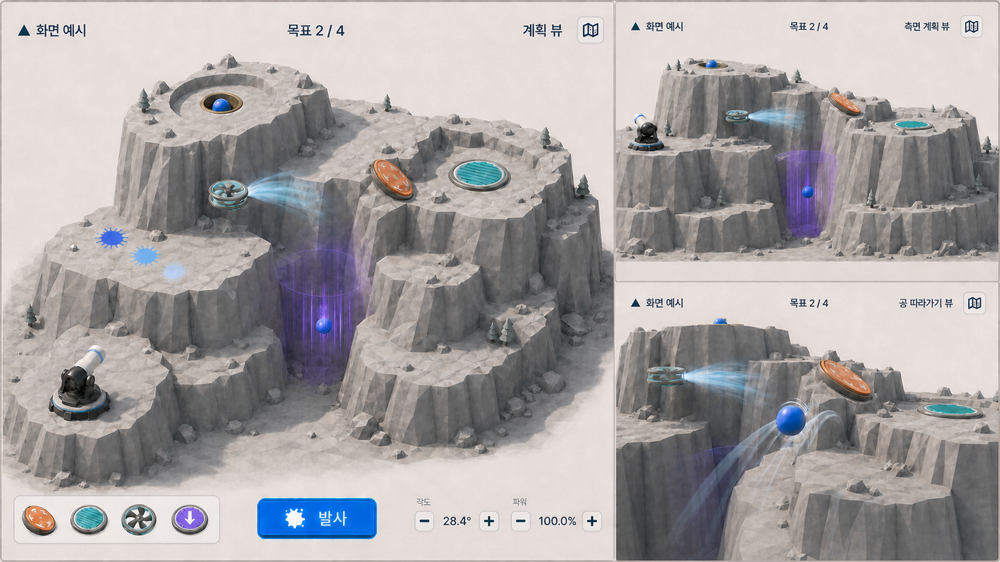

# Cannon Golf Design Rules

## Purpose

Preserve the useful visual discipline of Paint Mountain while preventing its
frontal mountain-coverage composition from becoming the default for the new
game.

## Scope

These rules govern planning and shot cameras, terrain presentation, settlement
goals, impact-history marks, placeable devices, course mechanisms, overlay HUD,
typography, color, and information hierarchy. They do not decide physics
coefficients, stage data formats, or code ownership.

## Requirements

### Product read

- The world must read as a 3D golf puzzle first and an artillery launcher
  second.
- A stage is a physical course with one or more settlement goals, not a
  paintable target surface. A goal may be a hole or a small bounded landing zone.
- The cannon, current ball, goals, settled balls, recent impact history, and
  selected device are the only persistent gameplay accents.

### Immediate screen direction

- File: `assets/cannon-golf-screen-direction-storyboard.png`
- SHA-256: `5FFFD31293C3643190C8EF9F2EBFF9BAB1F98BF5EF321470CE27E37BFC2672EF`
- This is the current visual explanation of the immediate screen change, not a
  runtime screenshot, pixel contract, final stage layout, or claim that every
  shown mechanism appears in one stage.
- The large left panel establishes the high-oblique planning composition. The
  upper-right panel is retained only as a historical height-reading reference;
  the runtime alternate is now the per-leg cannon view. The lower-right panel
  demonstrates temporary ball follow.
- Preserve the quiet warm HUD language, but replace coverage, timer, remaining
  balls, and remaining shots with three compact launch-control modules and one
  primary Fire action. Each module pairs a prominent current value and key hint
  with direct decrement, slider, and increment input. Overview, cannon view, ball
  follow, quick retry, pause, camera controls, and on-demand shortcut help remain
  small icon actions with accessible names.
- The combined board deliberately shows player-placed bounce, damping, airflow,
  and gravity in one frame so their visual roles can be compared. It does not
  set content order or inventory limits.

### Camera grammar

- Do not treat the inherited frontal Aim View as the default composition.
- Use a top or high-oblique planning view to explain lateral alignment, goal
  distribution, branch choice, and device placement.
- Use a true first-person view at the selected cannon source to show its actual
  launch direction. A small reticle and a world-space aim halo make yaw and
  elevation readable without implying a target or next goal. The halo floats
  slightly above the launcher base: a horizontal ring and compact perimeter
  tick show yaw, while a laterally offset dotted vertical arc and bead show
  elevation. It must not draw a center-origin line or wedge that can read as a
  second barrel. Keep it visible in both overview/planning and cannon views. Use
  unshaded high-contrast geometry with enough ordinary-view screen thickness;
  a narrow no-depth-tested accent may preserve readability without turning the
  whole instrument into a screen overlay.
- Use an oblique three-quarter view when both axes must remain readable.
- In overview, left-drag pans, right-drag orbits around the bounded course
  focus, the wheel changes distance, and arrow keys pan. A click without drag
  must not refocus or jump the pivot. Direct overview interaction during Shot
  Follow restores the stored overview before applying the input.
- Keep zoom bounded but materially useful in both directions. A compact reset
  action restores the authored high-oblique view, zero pan, and default distance.
  One wheel notch or compact zoom action must visibly change planning distance;
  do not require several repeated inputs before the course scale changes.
  Ten equal zoom-in actions reach a `28 m` desired minimum distance, while six
  zoom-out actions reach the complete-course fit. Keep the response logarithmic.
- Terrain collision shortens the camera boom. It must not lift the camera into
  a sky-dominant jump or let the near plane enter a cliff.
- Cannon first-person is a persistent selectable aim preset but not an
  exploration camera. Overview remains the complete-course planning owner.
- Shot Follow reveals cause and effect without locking input. Fire follows the
  newest ball automatically; `Tab`, overview, or cannon view returns to the
  exact stored pre-follow state. Aim and Fire remain usable while a ball lives.
- Camera changes must preserve stage identity, selected cannon source, selected
  device, and launch parameters.
- Whatever exploration controls are selected must not move gameplay objects,
  clear selection, alter aim, or invalidate confirmed goals. Returning to
  planning must restore a readable course framing.
- The high-oblique reset frames the complete course. The cannon reset returns
  to the selected source's local base direction. Pan, orbit, and bounded zoom
  still expose the full course, and the course selection preview frames its
  full depth.
- Avoid wide frontal terrain silhouettes that flatten front-to-back distance.

### Terrain language

- Favor courses that extend through depth or vertical sequence rather than
  filling the frame as one broad facade.
- Viable families include a stacked quarry, a chain of crater bowls, a slot
  canyon, terraced switchbacks, and compact ridge shelves.
- Terrain must have visible thickness, contact shadows, clear walkable or
  rollable faces, and legible gaps. It must not look like a card, backdrop, or
  flat height strip.
- The first two courses use a `315 x 180` metre generated mountain
  extent and must fit inside the real three-parameter launch envelope. Do not
  shrink or clip the mountain to make a shot appear feasible, and do not draw
  the envelope in normal play.
- Later courses expand progressively from the early `315 x 180` metre teaching
  scale to approximately `473 x 720` metres and `160` metres of relief. Their
  height must read as distinct peaks, broad shelves, ridges, and natural valleys,
  not repeated local pits. Ordered legs may rise or descend.
- Course generation must widen semantic landforms with the accepted horizontal
  scale and must not create hard multi-metre height steps. On the final shared
  render/collision height array, p95 adjacent-sample slope is at most `42`
  degrees, maximum slope is at most `60` degrees, at most `3%` of samples exceed
  `45` degrees, and relief remains within `target..target + 16 m`. Preserve broad
  peaks and protected start/goal supports while enforcing these limits.
- Each stage needs a readable direct route or a readable reason why a device is
  necessary.
- Decorative rocks and trees may communicate scale but must not hide goals,
  impact marks, balls, or pad faces.

### Settlement goals and settled balls

- A goal is a shallow physical landing plate placed on ordinary connected
  terrain, not a deep hole, crater, floating ring, target decal, or invisible
  trigger. Its complete floor must be visible from the authored overview.
- The plate has a flat or barely concave floor, a low retaining wall, and one
  broad lowered opening facing the incoming route. The wall catches low-energy
  roll without looking like a cup or blocking the plate from view.
- Terrain may fit a shallow support below the plate and blend back gradually,
  but it must not supply the goal wall or create a surrounding excavation.
- Entering a goal is not enough: a ball that bounces out before settlement must
  remain visibly unresolved and live. Exiting cancels only that settlement
  candidate; it must not delete the ball or prevent later re-entry.
- A confirmed goal must show the settled ball clearly from every planning view,
  and the ball must not move when later shots occur.
- All incomplete goals share the strongest available-goal flag and marker
  rhythm. Confirmed goals are led by their retained ball and a completed marker
  rhythm; there is no future or next-goal state in normal play.
  Keep the physical plate flag as the local landing cue. Add a thick matte 3D
  downward arrow above the local skyline for course-scale location; do not use
  a thin emissive stem or diamond.
  One small edge-aligned tally may show completed goals over total goals, such as
  `1 / 2`; it must not become a progress card or central status panel. Shape,
  height, spacing, and the confirmed ball must distinguish the world states in
  grayscale; color and contrast are secondary cues.
- A compact edge-aligned cannon-source selector lists `Start` plus completed
  goal numbers only. It is a location choice, not a target selector. Selecting
  a completed goal moves the cannon to that plate center and resets that source
  to `50 / 50 / 50`; confirmation never selects it automatically.
- The current-catalog ball uses one `2.0 m` physical and visual radius plus a
  dark navy, low-gloss material so it remains readable over the enlarged pale
  terrain without becoming a non-physical screen-space marker.
- A completed state must not rely on color alone.

### Impact-history marks

- Call the feature an `impact mark`, `impact history`, or `first-contact mark`.
  Do not call it surface paint, coverage, paint payload, or trail in product
  documents.
- Stamp one mark at the first valid terrain contact only.
- The newest mark is darkest, sharpest, and highest contrast. Each retained older
  mark is progressively lighter and visually quieter.
- Do not add splashes along the subsequent route, a painted wake, a coverage
  meter, a predicted impact ring, a floating label, or a numbered pin.
- Marks must remain legible against both lit and shaded terrain without using
  emission or a large glow.

### Devices and course mechanisms

- A bounce pad must sit on or conform to a physical surface and expose its
  outgoing direction through shape and orientation, not color alone.
- A damping pad must sit flat on a fully level legal surface. Its face and
  material must communicate grip and energy absorption rather than reflection;
  a flat bounded landing goal may contain it without hiding the goal boundary.
- An airflow device may be suspended in a valid air-placement volume. Show a
  short, restrained stream whose direction and affected width are legible, but
  do not draw an exact resulting trajectory.
- A gravity zone is placed by the player in a valid air volume. Its bounded
  volume and downward action must remain readable without implying that global
  gravity changed.
- Placement mode must show the legal surface or air volume, current orientation,
  stock, and invalid state without covering the route. The device tray must show
  only mechanisms the player can place in the current stage.
- Use top/oblique or per-leg cannon composition for placement; do not require the
  player to infer a wall normal from a frontal view.
- Bounce, damping, airflow, and gravity must have distinct silhouettes and
  motion cues in grayscale; color is supporting information only.
- Before player placement, the visible course contains no pad, fan, field, gate,
  or other route-changing mechanism. Terrain shape and goals must explain the
  problem without decorative fake mechanisms.

### Overlay HUD to reuse

- Retain Paint Mountain's Quiet Context qualities: warm paper-white surfaces,
  navy type, saturated blue for the sole primary action, Pretendard, Korean-first
  copy, edge alignment, generous padding, and minimal containment.
- Keep the course center open. Normal play may persist only one compact
  three-module aim panel, Fire, and overview, cannon-view, ball-follow,
  quick-retry, pause, a compact completed-goals/total-goals tally, camera, and
  help icon actions at safe edges. The help icon may open one concise shortcut
  panel at the upper-right edge; it stays collapsed by default and manages
  keyboard focus. Put full course reset, settings, course selection, and
  main-menu navigation in the pause overlay.
- Use one primary action per state. During launch setup, that action is Fire.
- Horizontal aim, vertical angle, power, device stock, the goal tally, and menu
  are valid only when they support a current decision. Do not persist course
  prose, a progress card, camera-state labels, feedback copy, permanently
  expanded shortcut legends, time, lives, finite ball stock, or remaining shots
  over normal play.
- Remove coverage rails, coverage percentages, paint icons, paint-result copy,
  and any control that implies terrain painting.
- Do not add dashboard cards, decorative borders, multiple shortcut owners,
  detached shortcut tiles, filler explanations, or duplicated state.

### Color and materials

- Preserve a restrained warm off-white and cool-gray world with clear faceting
  and soft daylight.
- Reserve saturated colors for the current ball, newest impact, selected device,
  primary action, and semantic state.
- Older impact marks should lose contrast and saturation while remaining
  distinguishable from terrain shading.
- Goal boundaries and pads must remain distinct when viewed in grayscale through
  shape, depth, and orientation.

## Acceptance Criteria

- A still from a planning state reads as 3D golf without explanatory copy.
- At least one top/high-oblique and one per-leg cannon view show every
  required goal and the selected pad without persistent HUD obstruction.
- Firing, switching views, exploring the course, quick retry, and returning from
  Shot Follow retain horizontal aim, vertical angle, power, impact history,
  placements, selection, and confirmed goals without clipping or invalid
  framing. The planning controls and next launch remain available while a prior
  ball is live, up to the prototype's simultaneous-ball limit.
- Three retained impact marks can be ordered newest to oldest from appearance
  alone.
- No normal gameplay capture shows surface coverage, continuous paint, an exact
  impact predictor, or a frontal-only planning composition.
- Korean labels fit without clipping at the 1280x720 logical baseline and at a
  wider desktop aspect ratio.
- The visible pad face, goal boundary, safe-settlement state, and occupied-goal
  state remain readable without depending on hue alone.
- A still distinguishes the angled bounce face, flat damping surface, suspended
  airflow source and stream, and bounded downward gravity field by shape and
  orientation rather than labels alone.

## Non-Goals

- Pixel-for-pixel reuse of a Paint Mountain screenshot.
- A photoreal golf course, sports broadcast presentation, or character avatar.
- A large device toolbar before the bounce-pad loop is validated.
- Treating the exploratory images in `RESEARCH.md` as approved camera targets.

## Related

- [`PRD.md`](PRD.md) owns product behavior.
- [`RESEARCH.md`](RESEARCH.md) records source material and the limits of the
  current concept images.
- [`OPEN_QUESTIONS.md`](OPEN_QUESTIONS.md) owns unresolved camera and interaction
  choices.
