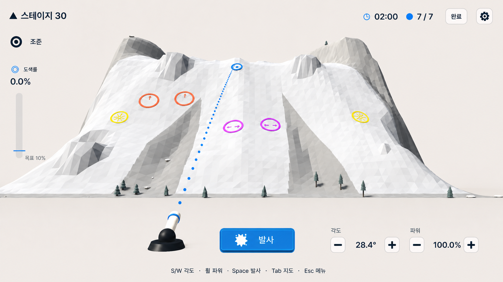
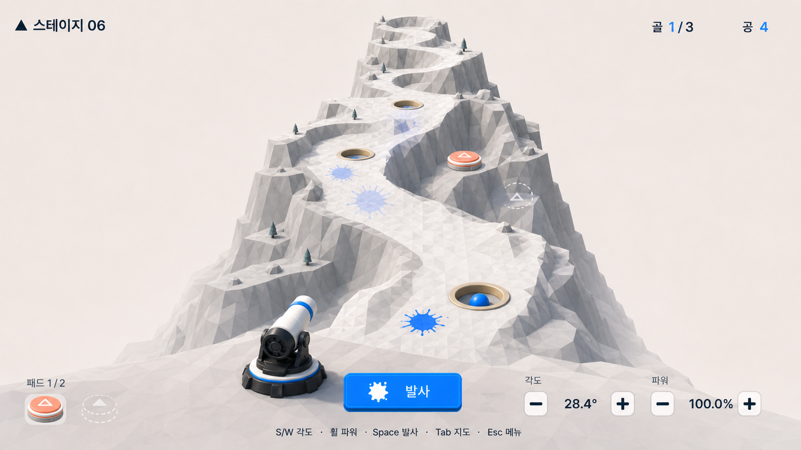
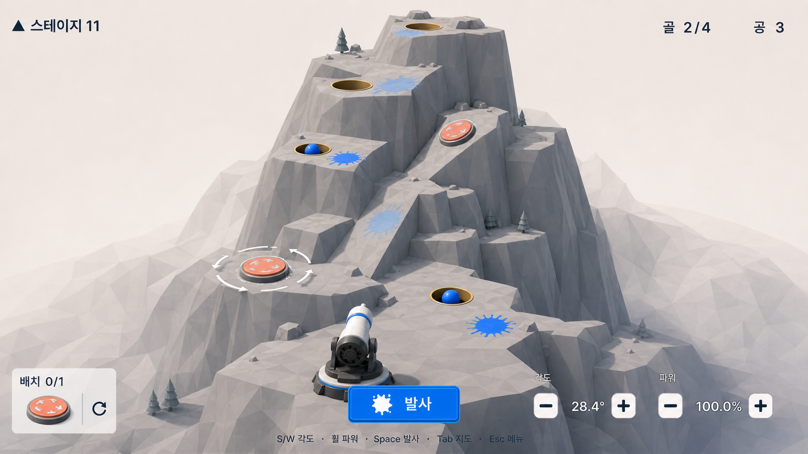
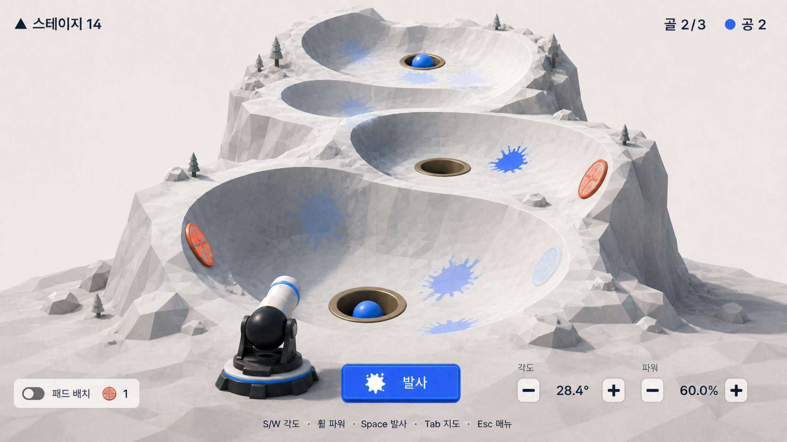

# Cannon Golf Research

## Purpose

Record the closest reference games and local visual evidence without treating
any reference as the product specification. The build case is the combination:
no reviewed product joins 3D cannon estimation, multiple settlement goals,
recency-ordered first-impact history, and player-placed bounce pads in the same
loop.

## Sources

### Constraint-based terrain generation evidence (2026-08-16)

| Source | Supported mechanism | Cannon Golf use |
| --- | --- | --- |
| [Terrain Synthesis Using Curve Networks](https://gigl.scs.carleton.ca/papers/curve-networks-terrain.pdf) | A sparse hierarchy of curves can encode salient peaks and ridges before patch interpolation | Generate a low-count ridge/valley graph from launcher and goal stations instead of asking noise to invent the course structure |
| [Terrain Sketching](https://pubs.cs.uct.ac.za/id/eprint/516/1/terrsketch.pdf) | Curvilinear, branching extrema and explicit boundary curves control ridges, river courses, and landform footprints | Treat ridge centerlines, valley centerlines, plateau edges, and the irregular outer silhouette as explicit constraints |
| [Feature Based Terrain Generation Using Diffusion Equation](https://doi.org/10.1111/j.1467-8659.2010.01806.x) | Elevation, ridge, valley, cliff, slope, and roughness constraints can be rasterized into one controllable heightfield | Evaluate compact-support feature fields on the existing grid and preserve protected supports/corridors during local blending |
| [Terrain Generation Using Procedural Models Based on Hydrology](https://doi.org/10.1145/2461912.2461996) | A hierarchical drainage graph produces coherent valleys, watersheds, ridges, and broad landform patches | Use a small abstract branch graph for mid/late valley and ridge topology; do not run full erosion or add literal rivers |
| [FHWA controlling criteria](https://highways.dot.gov/federal-lands/pddm/dpg/about-controlling-criteria) and [vertical curvature guidance](https://highways.dot.gov/safety/speed-management/speed-concepts-informational-guide/chapter-4-engineering-and-technical) | Alignment design separates maximum grade, cross slope, vertical clearance, curvature, and sight distance instead of using one global smoothness score | Protect each launcher-to-goal corridor with explicit clearance and smooth transition constraints while allowing steep cliffs outside it |
| [A Comparison of I/O-Efficient Algorithms for Visibility Computation on Massive Grid Terrains](https://arxiv.org/abs/1810.01946) | Grid-terrain visibility can be decided by interpolating terrain elevation along the horizontal projection of a viewpoint-to-target line | Sample the final shared heightfield along each overview-camera-to-flag line and reject occluded goal layouts before baking |
| [Distance Transforms of Sampled Functions](https://cs.brown.edu/people/pfelzens/papers/dt.pdf) | Distance fields turn sparse masks into deterministic clearance values | Use world-distance capsule fields around routes, starts, goals, and feature curves so protected areas are construction inputs |

These sources support a deterministic coarse-to-fine resolver: choose legal
ballistic stations first, derive a semantic landform graph, rasterize bounded
fields into one height grid, carve goal basins last, and admit the final grid by
trajectory clearance and overview line-of-sight. They do not support repeated
random terrain generation followed by a large physics search. Full hydraulic
erosion and a general constraint solver were rejected for this slice because
they add cost and failure modes without improving the three canonical visual
families.

### External product references

| Reference | Directly evidenced behavior | Useful lesson | Important gap |
| --- | --- | --- | --- |
| [Golf Peaks](https://store.steampowered.com/app/923260/Golf_Peaks/) | Isometric mountain golf puzzles; choose a stroke card and direction to reach a hole | High-oblique course readability, compact stages, gradual teaching | Turn-based card movement rather than physical cannon estimation |
| [Golf On Mars](https://store.steampowered.com/app/1340570/Golf_On_Mars/) | Side-view golf across long rocky terrain with altered gravity | Side/profile composition can make elevation and long-range correction readable | 2D, one-hole procedural golf; no devices or impact history |
| [Cannon Golf](https://jwd.itch.io/cannon-golf) | Cannon-launched golf across 54 holes with specialized shells | Cannon plus hole is an understandable product metaphor | 2D side view; no placeable devices or ordered impact memory |
| [Launch Ball](https://store.steampowered.com/app/3213560/Launch_Ball/) | Position a cannon and launch a ball at a target across authored physics puzzles | Minimal launch-correct-retry loop | 2D and box-targeted rather than multi-hole 3D golf |
| [Fantastic Contraption](https://store.steampowered.com/app/386690/Fantastic_Contraption/) | Build physical machines to carry a ball-like object to a distant goal | Player ownership of a physical route and readable device causality | Broad contraption building is much larger than the intended pad scope |
| [Crazy Machines 3](https://store.steampowered.com/app/351920/Crazy_Machines_3/) | Place missing pieces into physics chain reactions | Device placement should expose orientation and cause/effect before simulation | Rube Goldberg sandbox complexity would overwhelm the aiming loop |
| [Launchball](https://www.sciencemuseumgroup.org.uk/learning/resources/launchball-game/) | Thirty obstacle levels and a level creator built around springing a ball through a course | Small mechanical vocabulary can teach through authored obstacle stages | The official summary does not establish the exact desired cannon or multi-hole rules |
| [Aperture Tag](https://store.steampowered.com/app/280740/Aperture_Tag_The_Paint_Gun_Testing_Initiative/) | A first-person 3D paint gun applies movement-altering surface gels | A surface effect can communicate speed or rebound through material and shape | It is a player-navigation puzzle; paint changes mechanics and is not just impact memory |
| [Worms design comparison](https://www.team17.com/news/team17s-100-games-part-eighteen-2017-the-escapists-2-yooka-laylee-more) | Team17 describes Worms play in terms of power, angle, and wind | Result-based artillery correction remains legible without reflex control | Combat, destructible terrain, wind, and weapon variety are outside scope |

### Additional device candidate portfolio

This table preserves the evidence considered before the owner selected damping,
airflow, and local gravity behaviors in `DECISIONS.md`. External precedents do
not define their Cannon Golf implementation.

| Candidate family | Directly evidenced behavior | Distinct Cannon Golf verb | Main fit limit |
| --- | --- | --- | --- |
| Damping or brake pad | [Physics Puzzle Ball](https://store.steampowered.com/app/3744310/Physics_Puzzle_Ball/) describes ball strategy changing with bounce and dynamic/static friction | Remove energy at a chosen contact so a rebound-capable ball can settle in a small goal | A placeable damping pad is an inference; excessive damping could make settlement automatic |
| Fixed airflow device or corridor | [Croteam's device reference](https://taloseditor.croteam.com/device_reference/) exposes fan stream direction, size, and push speed; [Portal 2's tractor beam](https://developer.valvesoftware.com/wiki/Portal_2_Puzzle_Maker/Tractor_Beam) pushes or pulls objects through a visible volume | Intersect and ride a sustained force volume instead of reflecting from a surface | Oscillation, hidden falloff, or variable strength would make correction hard without an exact preview |
| Ball-triggered gate or latch | [Croteam's device reference](https://taloseditor.croteam.com/device_reference/) documents pressure plates, switches, and doors | Settle one ball to change route availability for a later shot | Adds state and reset rules; may feel like a generic key-and-lock puzzle if overused |
| Magnetic attractor or repulsor | [Balls and Magnets](https://store.steampowered.com/app/788320/Balls_and_Magnets/) uses attraction and repulsion to guide balls into holes | Curve a route around an obstacle without contact | Nonlinear force and invisible range may weaken result-based correction and require extra visualization |
| Transport beam | [Portal 2's tractor beam](https://developer.valvesoftware.com/wiki/Portal_2_Puzzle_Maker/Tractor_Beam) conveys objects in a straight line while suppressing gravity and prior momentum | Capture a ball into a guided aerial lane | May remove too much angle-and-power agency once entered |
| Fixed portal pair | [Portal](https://store.steampowered.com/app/400/Portal/) centers spatial puzzles on maneuvering objects through portals | Preserve an entry relationship while connecting separated course regions | High camera-disorientation and route-bypass risk; free endpoint placement would trivialize authored courses |
| Local gravity change | [Gravity Control](https://store.steampowered.com/app/1133350/Gravity_Control/) guides objects indirectly by changing gravity direction | Change which surface is down for a bounded region | Very high camera, physics, and golf-metaphor cost; invalidates ordinary ballistic assumptions |

#### Owner selection after portfolio review

- The owner selected a flat-surface damping pad that removes energy, a
  player-placeable mid-air airflow device that makes a small route correction,
  and a bounded gravity zone that creates a sharp downward drop.
- The ball-triggered gate, magnets, portals, and transport beams remain
  unselected. Their evidence remains useful only if later playtests reveal a
  different missing verb.
- The selected gravity behavior is narrower than a general gravity-direction
  mechanic: it acts as a local drop zone rather than redefining down for a whole
  stage.

### Local Paint Mountain baseline

- Source repository: `D:/npjt/paint-mountain` at commit `32c0b33`.
- Copied unchanged: `assets/`, `resources/`, `scenes/`, `scripts/`, `src/`,
  `tests/`, `translations/`, Godot project/export files, editor attributes, and
  asset-license documentation.
- Deliberately not copied: Paint Mountain product briefs, historical evidence,
  screenshots as runtime deliverables, prototypes, root agent policy, and the
  itch.io deployment workflow.
- Candidate reusable boundaries include cannon ballistics, projectile contact,
  terrain collision, camera coordination, typed Resources, Korean-first UI,
  localization, persistence, and automated tests.
- Known conflicting boundaries include continuous paint/coverage, target masks,
  exact predicted impact, broad mountain generation, fixed generated mechanisms,
  and coverage-based stage results.

#### Existing stage-authoring pipeline

- The inherited runtime has no custom Godot `EditorPlugin` or level-design dock.
  Stages are serialized `Resource` data transformed by an offline catalog
  builder.
- `StageGenerationProfile` describes route count, width, elevation changes,
  lateral bends, and slope gates. `SeededStageGenerator` resolves a route graph,
  synthesizes a heightfield-like terrain, rejects structural failures, and bakes
  deterministic layouts.
- Current validators cover finite heights, terrain edges, route clearance,
  slope distribution, fixed mechanism anchors, projectile range, target masks,
  and predicted-versus-rigid-body contact witnesses. These are useful technical
  precedents, but target masks, coverage, finite shots, and preinstalled
  mechanism anchors conflict with Cannon Golf.
- Cannon Golf needs new certification for goal settlement, persistent occupied
  goals, player device stock and transforms, surface and air placement legality,
  multiple ordered launches, and robustness to small input changes. The current
  generator cannot establish those properties.

### Local visual references

#### HUD qualities to retain

- File: `assets/paint-mountain-hud-comparator.png`
- SHA-256: `38F75235B126CC5995BA53E61665AEE9DCD397B27CA92939B08BE90ED10E76B1`
- Retain: Korean-first typography, warm paper-white field, navy hierarchy, blue
  primary action, edge alignment, restrained containment.
- Do not retain: coverage rail, paint iconography, exact predicted impact,
  broad frontal mountain, or the current world-camera relationship.

#### Paint Mountain world comparator

- File: `assets/paint-mountain-world-comparator.png`
- SHA-256: `1E32C82DF16DBE0809458DC7A7D9385C7EB3A61D0240BD8551B40F02190E4538`
- Retain: tactile low-poly depth, readable physical routes, sparse environment,
  strong gameplay accents.
- Do not retain: terrain coverage, continuous blue routes, fixed mechanisms,
  frontal-wide composition, or literal topology.

#### Early concept: ascending slot canyon

- File: `assets/early-concept-ascending-slot-canyon.png`
- SHA-256: `47909C628FF0A00FA0655FD37F7658502C0AE21F17E2E5D8DBD7E08402FBCD8C`
- Useful: long course, physical holes, settled ball, ordered impact marks.
- Rejected as a camera target: still too frontal and compresses the route into a
  centered climb.

#### Early concept: stacked quarry spine

- File: `assets/early-concept-stacked-quarry-spine.png`
- SHA-256: `6267464E038865B11C56425801A3127284458865719A0EC2EA645ADC56958616`
- Useful: strong vertical separation and readable pad orientation.
- Rejected as a camera target: still uses the inherited cannon-frontal hierarchy
  and does not demonstrate top or side planning.

#### Early concept: crater garden run

- File: `assets/early-concept-crater-garden-run.png`
- SHA-256: `376CDD04BB784E56071967F81139535B8820710850655ABFD51E4C99717942DC`
- Useful: a non-mountain terrain family, recessed goals, and wall-mounted pads.
- Rejected as a camera target: the framing remains mostly frontal and the basins
  need plan/profile views to communicate their true shape.

### Constraint-first course generation evidence (2026-08-14)

Primary sources support a coarse-to-fine pipeline, not a single closed-form
generator:

| Primary source | Directly supported lesson | Cannon Golf use |
| --- | --- | --- |
| [Tanagra: An Intelligent Level Design Assistant](https://ojs.aaai.org/index.php/AIIDE/article/view/12379) | Numerical movement constraints and reactive planning can build playable geometry around a modeled player action | Describe shot/route intent before committing exact terrain |
| [Path-First Platformer Generation](https://dmgregory.github.io/path-first.html) | Feasible movement traces can be produced first and geometry fitted around them | Let ballistic reachability constrain goal and corridor candidates |
| [Tanager: A Generator of Feasible and Engaging Levels](https://homepages.dcc.ufmg.br/~lferreira/assets/papers/2017/tciaig-evoab.pdf) | Physics simulation is used to validate stability/playability and an agent supplies a concrete solution | Treat a real-engine solution witness as required bake evidence |
| [Physics-Based Task Generation through Causal Sequences](https://ojs.aaai.org/index.php/AIIDE/article/view/27501) | Physics tasks need checks for stability, intended solutions and unintended solutions | Certify settlement and default miss after final geometry exists |
| [Deceptive Level Generation for Angry Birds](https://arxiv.org/abs/2106.01639) | Practical physics generation analyzes trajectories, retries failed placements, then revalidates stability and solvability | Use bounded backtracking from physics failure to goal/terrain candidates |
| [Godot 4.7 release policy](https://docs.godotengine.org/en/4.7/about/release_policy.html) | Godot states that its physics engine is not deterministic | Reproduce recipe/artifact hashes, but recertify outcome after engine changes |
| [Godot 4.7 ProjectSettings](https://docs.godotengine.org/en/4.7/classes/class_projectsettings.html) | The 3D backend and 60 Hz tick setting are explicit project inputs; `DEFAULT` may change | Pin `GodotPhysics3D`, ticks and engine identity in the certificate |

Recommended order:

1. Create a deterministic macro terrain prior and launcher state from a recipe.
2. Compute a cheap legal yaw/range/height region.
3. Select goal candidates and target approach from the intersection of that
   region, placement bounds and allowed local terrain change.
4. Condition the local goal, corridor and semantic landform; rebuild geometry.
5. Revalidate topology and ballistic admission on final geometry.
6. Run only the highest-ranked survivors through actual Godot physics, test a
   control neighborhood and the default miss, then bake the winner.
7. Backtrack or reject the recipe when a later leg or physics certificate fails.

Rejected simplifications:

- Analytic reachability as final proof after terrain collision is added.
- One perfect witness as evidence of a learnable solution.
- Geometry-first generation followed by one solver attempt.
- Exhaustive search over continuous controls and terrain values.
- A surrogate score in place of final real-engine simulation.
- A promise of bit-identical trajectories across Godot versions or machines.

#### Local bounded pilot

The storage-safe wrapper ran one `first_ridge` pilot on Godot `4.7.1` with zero
persistent-log growth and no remaining owned process:

- A two-unit elevation/power grid evaluated 1,380 analytic combinations and kept
  18 that crossed the existing bowl-to-lip goal column.
- The current authored `50 / 46° / 72%` witness ranked second by analytic bowl
  height error, so the cheap model did retain and rank a real solution well.
- Live physics repeated the center witness twice with the same successful result.
  Across center twice plus `±1°` elevation and `±1%` power, only `3/6` shots
  cleared. The default `50 / 50 / 50` did not advance.
- The live portion took most of the 39.3-second run. Therefore the resolver must
  filter/rank cheaply, simulate only a bounded finalist set and explicitly reject
  fragile one-point witnesses.

## Findings

- `3D golf` is the clearest public-facing shorthand, while `artillery` explains
  the launch controls and repeated estimation.
- Golf Peaks demonstrates that a high-oblique view can make a whole compact
  course legible without a behind-ball camera.
- Golf On Mars and Cannon Golf demonstrate that a side view is strong for
  elevation and power correction.
- Contraption games demonstrate the appeal of authoring part of the route, but
  their tool breadth would dilute the current product. One pad is a better MVP.
- The early generated images capture holes, balls, marks, and pads but do not
  solve the user's camera concern. Their camera is evidence of what to change.
- Paint Mountain's HUD system is more reusable than its world composition or
  product semantics.
- The selected additions separate three useful verbs: remove energy on a flat
  landing surface, make a small mid-air correction, and force a sharp local
  vertical drop.
- Constraint-first generation is a good fit only when analytic reachability is
  followed by final-geometry validation, exact physics replay and bounded
  backtracking. The local pilot confirms both the filtering value and the risk
  of a fragile single witness.
- This is not a weak build case: no reviewed reference supplies the complete
  combination, and the existing local runtime materially reduces technical
  startup cost.

## Recommendations

- Use the screen-direction storyboard in `DESIGN_RULES.md` as the visual brief,
  then compare a runtime-feasible graybox from true top, high-oblique, true side,
  near-profile, and temporary launch-follow views.
- Validate the direct-shot and bounce-pad loop before committing expansion-stage
  counts, even though the later mechanic vocabulary is now selected.
- Author high-level course recipes, let the bounded offline resolver select exact
  geometry and witnesses, and bake only real-physics-certified artifacts. Add a
  Godot editor plugin only after this workflow reveals stable repeated operations.
- Audit candidate code owners against `PRD.md` before any rename or rewrite.

## Limitations

- Store pages describe marketed behavior, not full control details or physics
  tolerances.
- The local early concepts are generated illustrations, not feasible geometry,
  runtime screenshots, or approved layouts.
- The screen-direction storyboard is generated design evidence, not feasible
  geometry, a runtime capture, or a final camera-transition specification.
- Exact aiming controls, camera transitions, mark retention, pad editing,
  placement-device tolerances, and confirmed-ball collision treatment still
  require owner decisions. The direct-shot certification tolerance is accepted
  separately in `DECISIONS.md` D-032.

## HUD external-model review, 2026-08-16

Antigravity job `20260816T113512517Z-f6364710-43a1-4eb2-b0ac-febe14b9128d`
reviewed the current HUD scene, script, specifications, and fresh 1280 by 720
planning, cannon, and shortcut captures. Its saved answer is immutable at
`C:\Users\BK\.codex\tools\model-cli-mcp\logs\jobs\20260816T113512517Z-f6364710-43a1-4eb2-b0ac-febe14b9128d\answer.md`.
The saved artifact contains an explicit truncated middle section, so only its
preserved statements are treated as external-model evidence. A later concise
job did not reconstruct the missing content and is not used as substitute
evidence.

Codex accepted these points after checking them against the current source and
product rules:

- Keep the bottom-center cannon and near-ground view clear. The current 792 px
  aim panel crosses the screen center and obscures the cannon-view origin.
- Standardize the top status/source controls to one baseline and about 48 px
  height; standardize bottom control surfaces to one baseline and about 80 px
  height.
- Keep all three aim modules editable in both overview and cannon views. Do not
  solve occlusion by hiding the controls.
- Replace the current single wrapping focus chain with spatially coherent
  cluster navigation that matches visible control groups.
- Keep Fire fixed as the sole primary action. Reveal Follow and Quick Retry only
  when a live ball makes those decisions relevant, expanding leftward without
  moving Fire.
- Treat overview zoom/reset as overview-only exploration controls. Cannon view
  is a fixed aim preset, so it must not present the same exploration dock.
- Prefer short text for the two persistent view choices and familiar icons only
  for unambiguous utility actions; the current Unicode view/follow glyphs do not
  explain their state well enough.

Rejected directions:

- World-space target cards, a complete trajectory, or a predicted landing
  marker.
- Dashboard cards, multiple tabs, or permanently expanded help.
- Drag-only aiming that removes the exact steppers, sliders, values, and key
  pairs required by D-027.
- Collapsing aim controls in cannon view, borderless controls without a clear
  focus state, or color-only selected/disabled state.
